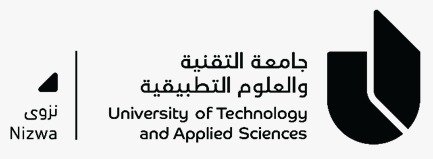

# Heat Exchanger Lab | Parallel & Counter Flow

> **Interactive Virtual Laboratory for Thermal Engineering Education**

A responsive, dependency-free web application for parallel-flow and counter-flow heat exchanger experiments. Designed for students at the College of Engineering & Technology to conduct virtual laboratory experiments with real-time calculations and comprehensive assessment tools.



## 🎯 Overview

This application provides an interactive learning environment for studying heat exchanger effectiveness. Students can:
- Configure parallel or counter-flow arrangements
- Record temperature measurements from apparatus simulations
- Calculate heat transfer, LMTD, and overall coefficient in real-time
- Generate professional laboratory reports
- Complete comprehensive assessment quizzes
- Track class performance through the built-in grade register

## 🚀 Quick Start

### Option 1: Direct File Access
Open `index.html` directly in your web browser.

### Option 2: Local Server (Recommended)
For optimal browser behavior and local storage functionality:

```bash
python -m http.server 8000
```

Then visit `http://localhost:8000` in your browser.

### Option 3: VS Code Debugger
1. Open the workspace in VS Code
2. Press `F5` to start debugging
3. Select "Chrome with Server" configuration
4. The application will launch with debugging tools enabled

## ✨ Features

### Experiment Interface
- **Parallel/Counter Flow Tabs** - Switch between flow configurations
- **Apparatus Visualization** - Animated heat exchanger with temperature displays
- **Five-Run Experiment Table** - Record multiple measurements
- **Real-Time Calculations** - Automatic computation of thermal properties
- **Live Apparatus Readings** - Display of T1, T2, t1, t2 temperatures
- **CSV Export** - Download observation data for external analysis
- **Print Report** - Generate professional laboratory reports

### Assessment Features
- **Comprehensive Quiz Bank** - 120 viva questions (60 parallel, 60 counter-flow)
- **Random Question Selection** - Four random questions per student
- **Automatic Grading** - Four-mark assessment with instant feedback
- **Class Grade Register** - Track up to 30 students with CSV export
- **Local Storage** - Results persist in browser; export for centralized database

### User Experience
- **Responsive Design** - Optimized for desktop, tablet, and mobile
- **Accessible Interface** - Semantic HTML and WCAG-compliant controls
- **Dependency-Free** - Pure HTML, CSS, and JavaScript; no frameworks required
- **University Branding** - Institutional header and styling
- **Data Validation** - Input validation and error handling

## 📐 Calculation Basis

### Constants
- **Water Specific Heat:** 4187 J/kg·K
- **Collection Volume:** 1 liter per reading
- **Inner Tube Diameter:** 12.5 mm (0.0125 m)
- **Exchanger Length:** 1.5 m
- **Heat Transfer Area:** A = π × D × L ≈ 0.0589 m²

### Key Equations
- **Heat Transfer (Q):** Q = m × Cp × ΔT
- **LMTD (Parallel):** ΔT₁ = |T₁ - t₂|, ΔT₂ = |T₂ - t₁|
- **LMTD (Counter):** ΔT₁ = |T₁ - t₁|, ΔT₂ = |T₂ - t₂|
- **Overall Coefficient (U):** U = Q / (A × LMTD)
- **Effectiveness (ε):** ε = (Actual Q) / (Max Q)

## 📁 Project Structure

```
heat-exchanger-demo/
├── index.html          # Main application interface
├── app.js              # Core calculation and UI logic
├── quiz-bank.js        # Assessment questions and grading
├── styles.css          # Responsive styling
├── README.md           # Project documentation
├── LICENSE             # Proprietary software license
├── .vscode/
│   ├── launch.json     # VS Code debugger configuration
│   └── tasks.json      # Build and run tasks
└── assets/
    └── utas-nizwa.jpeg # University branding logo
```

## 🔧 Browser Requirements

- Modern browser with ES6 JavaScript support
- Local Storage API (for quiz results and grade register)
- CSS Grid and Flexbox support
- Canvas API (for interactive visualizations)

**Tested On:**
- Chrome 90+
- Firefox 88+
- Safari 14+
- Edge 90+

## 📚 Usage Instructions

### Conducting an Experiment

1. **Select Flow Configuration** - Choose "Parallel flow" or "Counter flow" tab
2. **Choose Observation Run** - Select from Run 1-5 dropdown
3. **Record Measurements** - Edit temperature values in the observation table
4. **View Calculations** - Heat transfer, LMTD, U-value, and effectiveness update automatically
5. **Export Data** - Click "Export CSV" to download results
6. **Print Report** - Click "Print report" for formatted laboratory report

### Taking the Assessment

1. Navigate to **Quiz** section
2. Enter your student name and ID
3. Answer four random viva questions
4. Submit for automatic grading
5. View your score (0-4 marks)
6. Repeat for additional attempts

### Managing Class Records

1. Access the **Grade Register** (in Quiz section)
2. Enter student names and IDs
3. Record quiz scores
4. Export class data as CSV for your records
5. Clear records to reset for next class

## ⚠️ Important Notes

- **Sample Data:** The included temperature values are demonstration readings
- **Laboratory Use:** Replace with actual measured values from physical apparatus before submission
- **Local Storage:** Quiz results are stored locally in the browser; clear browser data to reset
- **Centralized Database:** For multi-device deployments, configure server-side database backend
- **Accuracy:** Calculations assume ideal conditions; real-world performance may vary

## 🤝 Data Privacy

- No data is sent to external servers
- All calculations performed locally in the browser
- Results stored only in local browser storage
- Export functionality creates client-side files only

## ⚖️ License

**Proprietary Software License** - All rights reserved by University of Technology and Applied Sciences, Nizwa.

This software is provided for educational use at authorized institutions only. Commercial use, modification, or redistribution is strictly prohibited without prior written consent.

See [LICENSE](LICENSE) file for complete terms and conditions.

## 📧 Support & Inquiries

For technical support, licensing inquiries, or feature requests:

**University of Technology and Applied Sciences, Nizwa**  
College of Engineering & Technology  
Mechanical and Industrial Section  

---

**Version:** 1.0.0  
**Last Updated:** 2024  
**Status:** Production Ready
